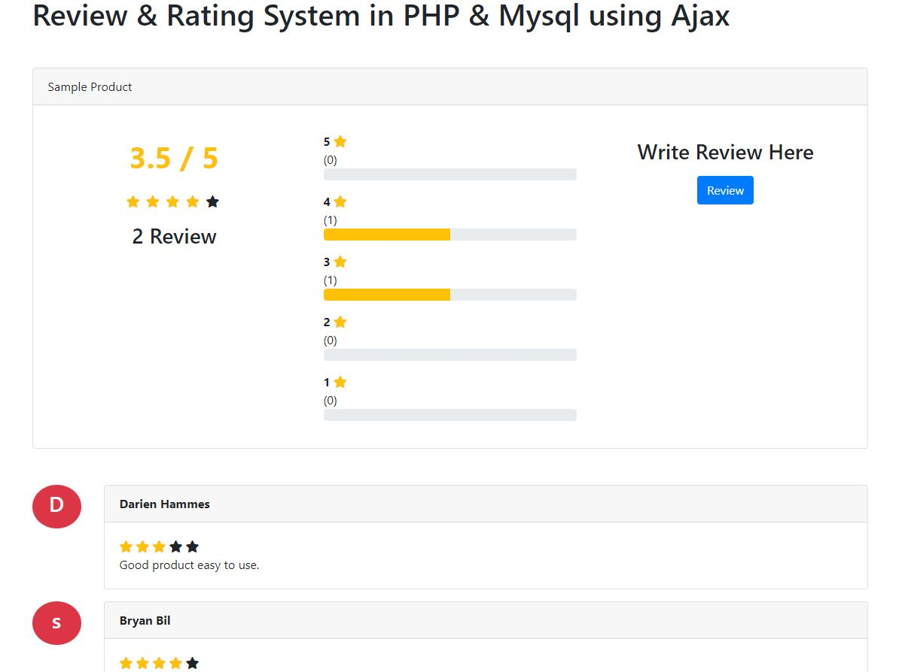

## PHP-Simple-Ratings

Calculates Average ratings of the current product with user comments section.
Project is made from a simple bootstrap and php mysql.

## Getting started
Follow the instruction to setup the project:

1. Run Apache server
2. Migrate/import database on `migrate/ratings.sql`
3. Open `index.php` on browser

End
